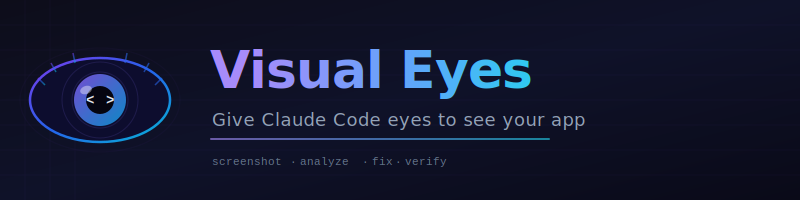

<p align="center">
  
</p>

<p align="center">
  <strong>Give Claude Code eyes to see your running app</strong><br>
  <sub>Screenshot, analyze, fix, verify - the visual feedback loop AI coding assistants were missing</sub>
</p>

<p align="center">
  <a href="#-install">Install</a> ·
  <a href="#-how-it-works">How it Works</a> ·
  <a href="#-features">Features</a> ·
  <a href="#-usage-examples">Examples</a> ·
  <a href="#-requirements">Requirements</a>
</p>

<p align="center">
  
  
  
  
  
</p>

---

## The Problem

Claude Code can write incredible code - but it's **blind to the result**.

Frontend devs waste 10 minutes describing a visual bug in words, while Claude guesses what's wrong and ships fixes that introduce new problems. You describe, Claude guesses, you describe again. Repeat until frustration.

**Visual Eyes gives Claude actual vision.** Take a screenshot, Claude sees it, Claude fixes it, Claude verifies the fix - in one loop.

---

## How it Works

```
You: "how does the dashboard look?"

  -> Visual Eyes takes screenshot of localhost:3000
  -> Claude SEES the image (multimodal vision)
  -> Claude identifies: broken grid, misaligned header, overflow text
  -> Claude edits the code
  -> Takes new screenshot to verify
  -> "Fixed. Header is now 20px lower, grid realigned. Want to check mobile?"
```

No more guessing. No more describing pixels. Just fix it.

---

## Install

```bash
# One-liner (recommended)
curl -fsSL https://raw.githubusercontent.com/nikolasdehor/visual-eyes/main/install.sh | bash
```

```bash
# Claude Code plugin
claude plugins install github:nikolasdehor/visual-eyes
```

```bash
# Manual (git)
git clone https://github.com/nikolasdehor/visual-eyes.git
cp -r visual-eyes/skills/visual-eyes ~/.claude/skills/
```

After installing, **restart Claude Code** and say anything - it just works.

---

## Features

| | Feature | What it does |
|---|---|---|
| 📸 | **Screenshot Capture** | Desktop, mobile (iPhone/Android), full-page, specific routes |
| 👁 | **Visual Analysis** | Claude sees and understands layout, colors, typography, spacing |
| 🔁 | **Auto-Fix Loop** | Identify bug -> edit code -> screenshot -> verify -> repeat |
| 🔬 | **Visual Regression** | Before/after pixel diff with highlighted changes |
| 📱 | **Responsive Testing** | Desktop + tablet + mobile side by side in one command |
| ⚡ | **Zero Config** | Works with any localhost app - React, Next.js, Vue, anything |

---

## Usage Examples

Just talk to Claude naturally. The skill activates automatically.

```
"screenshot the homepage"
```

```
"how does the dashboard look on mobile?"
```

```
"there's a visual bug on the settings page - find and fix it"
```

```
"compare before and after my CSS changes"
```

```
"check all routes for visual regressions"
```

```
"the sidebar is overlapping the content, fix it"
```

```
"show me desktop, tablet, and mobile side by side"
```

---

## Requirements

- **Claude Code** - any plan (Free, Pro, Teams)
- **Node.js 18+** - for Playwright
- **Playwright browsers** - installed automatically, or run manually:

```bash
npx playwright install chromium
```

That's it. No API keys. No config files. No setup wizard.

---

## How It Compares

| | Without Visual Eyes | With Visual Eyes |
|---|---|---|
| See your app | Describe bugs in words | Claude sees the actual screenshot |
| Fix UI bugs | Manual back-and-forth guessing | Automated see-fix-verify loop |
| Regression testing | "It looked fine before..." | Pixel-level diff, red = changed |
| Responsive check | Resize browser manually | Desktop + tablet + mobile at once |
| Fix verification | Guess and deploy | Screenshot confirms the fix worked |

---

## Roadmap

- [x] v1.0 - Screenshot capture + visual analysis + auto-fix loop
- [x] v1.0 - Visual regression diff (before/after pixel comparison)
- [x] v1.0 - Responsive testing (desktop + tablet + mobile)
- [ ] v1.1 - Video recording of interactions
- [ ] v1.2 - Accessibility audit (WCAG compliance check)
- [ ] v1.3 - Component isolation (screenshot a single React component)
- [ ] v2.0 - Visual test suite with CI integration

---

## Contributing

PRs are welcome. If you find a bug or want a feature, open an issue.

If you're building a Claude Code skill and want ideas, this repo's structure (`skills/visual-eyes/SKILL.md`) is a good reference for how skills are built.

---

## License

MIT - see [LICENSE](LICENSE)

---

<p align="center">
  Built by <a href="https://github.com/nikolasdehor">Nikolas de Hor</a>
  <br><br>
  <sub>Because AI should see what it builds</sub>
</p>
