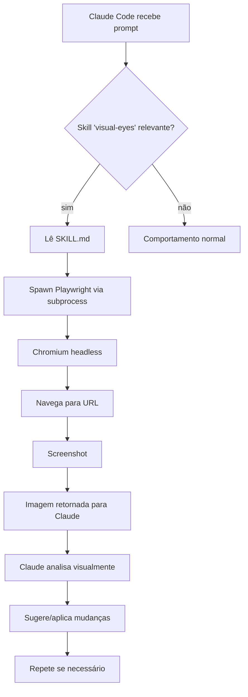

# Como funciona

## Arquitetura



## Componentes

### SKILL.md

A "alma" da skill. Documento markdown que o Claude lê quando relevante, contendo:

- Quando usar a skill
- Comandos disponíveis (via Playwright)
- Exemplos de prompts
- Output esperado

Veja [skills/visual-eyes/SKILL.md](https://github.com/nikolasdehor/visual-eyes/blob/main/skills/visual-eyes/SKILL.md) no repo.

### Helper scripts

- `install.sh` — instala a skill em `~/.claude/skills/` ou `.claude/skills/`
- `uninstall.sh` — remove
- `tests/sanity.sh` — smoke test
- `tests/validate.sh` — validação pós-install

### Dependências runtime

- **Playwright** (`npx playwright`) — controle de browser headless
- **Chromium** — browser principal (baixado uma vez, ~150 MB)
- **bash / Node 18+** — runtime do helper

## Fluxo de uma chamada típica

1. Usuário pede ao Claude algo que envolve "ver" a UI
2. Claude detecta que precisa da skill
3. Lê `SKILL.md` para entender comandos
4. Executa via Bash tool do Claude Code:
   ```bash
   npx playwright codegen --target=javascript http://localhost:3000
   # ou
   node -e "
     const { chromium } = require('playwright');
     (async () => {
       const browser = await chromium.launch();
       const page = await browser.newPage({ viewport: { width: 1280, height: 720 } });
       await page.goto('http://localhost:3000');
       await page.screenshot({ path: 'screenshot.png' });
       await browser.close();
     })();
   "
   ```
5. Lê a imagem gerada (Claude Code suporta análise de imagens nativamente)
6. Raciocina visualmente, propõe ações

## Por que não LSP / DOM inspection

LSP entende código, não pixels. Inspeção DOM diz "div com classe X", não "esse div está cobrindo o botão de checkout". Para tarefas visuais reais, screenshots > DOM.

## Por que não API de visão dedicada

Browsers headless já são padrão de mercado, gratuitos, com APIs ricas. Não há razão pra reinventar a roda.

## Segurança

A skill executa código em browser headless local. Você controla:

- Que URL acessar (você fornece no prompt)
- Que dados expor (não envie URLs com tokens reais)
- Onde salvar screenshots (default: `./screenshots/`)

Em CI, considere isolar com containers.
