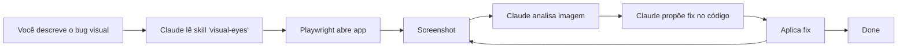

# Visual Eyes

**Dê olhos ao Claude Code.** Skill que permite ao Claude ver aplicações web rodando via Playwright e fazer testing visual, screenshot analysis e auto-fix.

[](https://github.com/nikolasdehor/visual-eyes/blob/main/LICENSE)
[](https://docs.claude.com/en/docs/claude-code/skills)

## O problema

O Claude Code é incrível escrevendo código, mas ele **não vê** o que sua app está mostrando. Quando você diz "o botão azul está fora do lugar", ele tem que adivinhar o que você quer dizer porque só lê o código fonte.

## A solução

Visual Eyes dá ao Claude a capacidade de:

- Abrir a app no Chromium via Playwright
- Tirar screenshots
- Analisar visualmente o que está na tela
- Comparar antes vs depois de mudanças
- Iterar até o resultado ficar como você descreveu



## Exemplo

```
Você: "o título está apertado no mobile, dá um respiro nele"

Claude:
1. Lê skill visual-eyes
2. Inicia Playwright em viewport 375x812 (iPhone)
3. Navega pra http://localhost:3000
4. Screenshot
5. Identifica: padding-top: 8px é muito apertado
6. Edita CSS: padding-top: 24px
7. Screenshot novamente
8. Compara: agora respirado, ok
9. Reporta: 'feito, ajustei padding-top'
```

## Quick start

```bash
# Instala a skill no Claude Code (escopo: usuário ou projeto)
npx visual-eyes-install --scope=user
```

Em qualquer projeto web, peça ao Claude:

> "Use a skill visual-eyes pra ver como meu app está rodando em http://localhost:3000 e me ajude a corrigir o layout do header"

## Onde ir agora

[:material-rocket: Instalação](getting-started/install.md){ .md-button .md-button--primary }
[:material-eye: Como funciona](how-it-works.md){ .md-button }
[:material-github: GitHub](https://github.com/nikolasdehor/visual-eyes){ .md-button }
